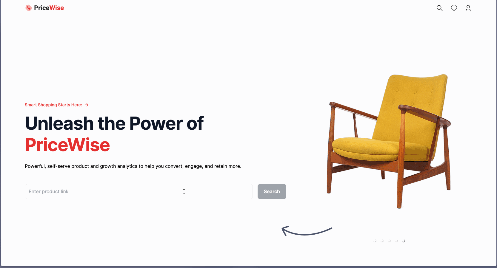
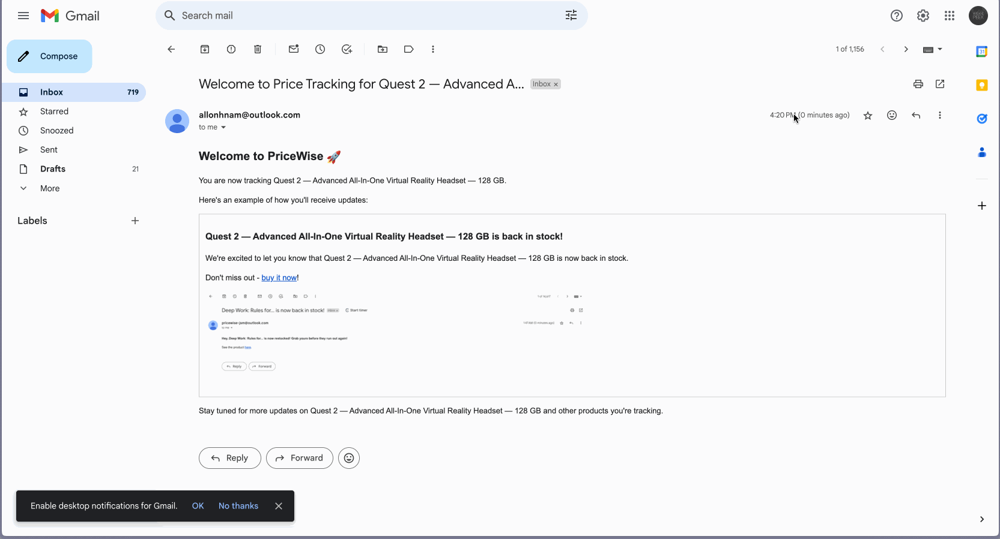

# PriceWise

[LIVE](https://pricewise-allon.vercel.app/)

## Overview
PriceWise is a web scraping app that tracks Amazon product prices in real-time and sends updates via email.

## Key Features

### Interactive Hero Page
PriceWise not only features an interactive Hero Page with carousels and link input but also remembers the items you were tracking.

### Web Scraping
You can see how the prices of your favorite Amazon products have changed using cutting-edge web scraping technology!

### Email Updates
Just a few seconds after clicking on "track," you will receive an email about the item you were tracking.

### Responsive Design
PriceWise can also be rendered cleanly and optimized for smaller devices, such as phones and tablets.

## Technologies
+ Languages: TypeScript, HTML/CSS
+ Frameworks: React, Next.js 14
+ Runtime: Node.js
+ Databases: MongoDB
+ Libraries/APIs: Axios, Cheerio, Mongoose, TailwindCSS, Headless UI
+ Utilities/Services: Cron, BrightData
+ Deployment: Vercel

## Future Prospects
+ Implement functions such as user profile and likes
+ Web scrape data for the product's likes and comments
+ implement OpenAI to scrape any data despite the website's HTML change